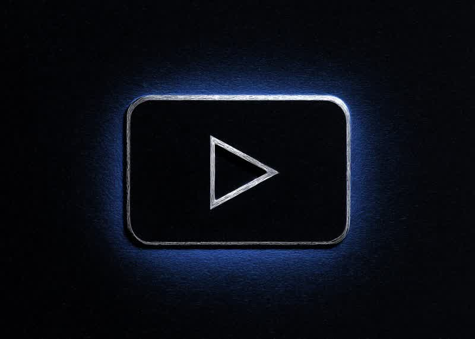

# 🎬 YouTube Publisher

**[🇬🇧 Read in English](README.md)**

<p align="center">
  
</p>

> Одна команда. Ссылка на Google Drive → опубликованное видео на YouTube.  
> С транскриптом, таймкодами и метаданными. Полностью автоматически.

---

## Проблема

Вы записали встречу, лекцию, подкаст. Файл лежит в Google Drive. Дальше что?

1. Скачать 2 ГБ файл на свою машину
2. Открыть YouTube Studio, ждать загрузку
3. Придумать название, написать описание
4. Вручную прокручивать видео, чтобы расставить таймкоды
5. Скопировать всё, нажать «опубликовать»
6. Удалить локальный файл, чтобы освободить место

**Это 30-60 минут скучной работы на каждое видео.** Умножьте на десятки записей в месяц.

## Решение

```bash
python3 scripts/publish.py "https://drive.google.com/file/d/abc123/view"
```

Всё. Скрипт сам:

- ⬇️ **Скачивает** из Google Drive (без возни с файлами)
- 📤 **Загружает** на YouTube (resumable upload, большие файлы)
- 🎤 **Транскрибирует** аудио через Fireworks Whisper или Deepgram Nova-3
- ⏱️ **Генерирует таймкоды** по границам тем
- 📝 **Создаёт название и описание** из транскрипта
- 🧹 **Удаляет** все временные файлы

**Время: ~5 минут на часовое видео** (в основном загрузка/транскрипция, ноль ручной работы).

## Быстрый старт

### 1. Клонировать

```bash
git clone https://github.com/smixs/youtube-publisher.git
cd youtube-publisher
```

### 2. Настроить Google OAuth

Нужны OAuth-креды для Google Drive (скачивание) и YouTube (загрузка):

1. Зайти в [Google Cloud Console](https://console.cloud.google.com)
2. Создать проект (или использовать существующий)
3. Включить **Google Drive API** и **YouTube Data API v3**
4. **Credentials** → **Create Credentials** → **OAuth 2.0 Client ID**
   - Тип: **Desktop app**
   - Скачать JSON-файл
5. Переименовать в `google-oauth-client.json` и положить в папку `config/`
6. Запустить авторизацию для получения `google-oauth-tokens.json`:

```bash
python3 scripts/setup_oauth.py
```

Необходимые scopes:
- `https://www.googleapis.com/auth/drive.readonly`
- `https://www.googleapis.com/auth/youtube.upload`
- `https://www.googleapis.com/auth/youtube`

### 3. Настроить транскрипцию

Нужен хотя бы один API-ключ для транскрипции:

**Вариант A — Fireworks AI** (рекомендуется: быстрее, $0.0009/мин)
```bash
export FIREWORKS_API_KEY=your_key_here
# или сохранить в config/fireworks-api-key.txt
```

**Вариант B — Deepgram** (альтернатива: отличное качество)
```bash
export DEEPGRAM_API_KEY=your_key_here
# или сохранить в config/deepgram-api-key.txt
```

### 4. Установить ffmpeg

```bash
# Ubuntu/Debian
sudo apt install ffmpeg

# macOS
brew install ffmpeg
```

### 5. Запустить

```bash
python3 scripts/publish.py "https://drive.google.com/file/d/YOUR_FILE_ID/view"
```

## Использование

```bash
# Базовое — загрузка как unlisted, автовыбор транскрибера
python3 scripts/publish.py "DRIVE_URL"

# Публичное видео на английском
python3 scripts/publish.py "DRIVE_URL" --privacy public --language en

# Только транскрипция, без загрузки на YouTube
python3 scripts/publish.py "DRIVE_URL" --skip-upload

# Обновить метаданные существующего видео
python3 scripts/publish.py "DRIVE_URL" --video-id dQw4w9WgXcQ --title "Моё видео"

# Принудительно использовать Deepgram
python3 scripts/publish.py "DRIVE_URL" --transcriber deepgram

# Сохранить временные файлы
python3 scripts/publish.py "DRIVE_URL" --keep-files
```

### Параметры

| Флаг | По умолчанию | Описание |
|------|-------------|----------|
| `--privacy` | `unlisted` | `public`, `unlisted` или `private` |
| `--language` | `ru` | Язык для транскрипции |
| `--transcriber` | `auto` | `auto`, `fireworks` или `deepgram` |
| `--skip-upload` | — | Только транскрипция |
| `--video-id` | — | Обновить существующее видео |
| `--title` | — | Задать название вручную |
| `--keep-files` | — | Не удалять временные файлы |
| `--category` | `28` | ID категории YouTube |

## Как это работает

```
Google Drive          YouTube             Транскрипция
     │                   │                     │
     ▼                   ▼                     ▼
 Скачать ───→ Загрузить → Извлечь ──→ Разбить → Транскрибировать
   .mp4       видео       аудио     15-мин      (параллельно)
                │         .mp3      чанки           │
                │                                    ▼
                │                             Склеить + сгенерировать
                │                             таймкоды и метаданные
                │                                    │
                ▼                                    ▼
           Обновить ◄──────────────────── название, описание,
           метаданные                     теги, таймкоды
                │
                ▼
           Очистить временные файлы
```

### Пайплайн транскрипции

- Аудио извлекается в 64kbps моно, 16kHz (оптимально для речи, ~1 МБ/мин)
- Разбивается на 15-минутные чанки для параллельной обработки (6 воркеров)
- Каждый чанк транскрибируется отдельно, затем склеивается со смещением по времени
- Таймкоды генерируются по границам тем (минимум 3 минуты между метками)

### Формат таймкодов

| Длительность | Формат | Пример |
|-------------|--------|--------|
| До 1 часа | `MM:SS` | `05:30`, `45:12` |
| Больше 1 часа | `H:MM:SS` | `1:00:01`, `1:25:30` |

YouTube автоматически превращает их в кликабельные главы.

## Порядок поиска ключей

Скрипт ищет креды в таком порядке:

1. **Корень скилла** — `youtube-publisher/google-oauth-client.json`
2. **Папка config** — `youtube-publisher/config/google-oauth-client.json`
3. **Workspace** — `~/.openclaw/workspace/scripts/google-oauth-client.json`
4. **Переменная окружения** — `GOOGLE_OAUTH_CLIENT` (путь к файлу)

API-ключи аналогично:
- `FIREWORKS_API_KEY` env → `config/fireworks-api-key.txt`
- `DEEPGRAM_API_KEY` env → `config/deepgram-api-key.txt`

## Как скилл OpenClaw

Этот репозиторий - также скилл для [OpenClaw](https://github.com/openclaw/openclaw). Установка:

```bash
openclaw skill install youtube-publisher
```

Или скопируйте `SKILL.md` и `scripts/` в `skills/youtube-publisher/` вашего workspace.

Агент запускает пайплайн по фразам вроде:
- *«залей это видео на YouTube»*
- *«опубликуй запись с созвона»*
- *«транскрибируй и выложи»*

## Требования

- **Python 3.8+** (только стандартная библиотека, pip-пакеты не нужны)
- **ffmpeg** — извлечение и нарезка аудио
- **Google Cloud проект** с Drive API + YouTube Data API v3
- **Минимум один ключ транскрипции** (Fireworks или Deepgram)

## Ограничения

- Источник - только Google Drive (локальные файлы пока не поддерживаются)
- Лимит YouTube: 6 видео в день
- Генерация таймкодов эвристическая (лучше работает на структурированном контенте)
- Генерация названия/описания базовая - рекомендуется проверка

## Лицензия

MIT

## Автор

[Serge Shima](https://github.com/smixs) · [TDI Group](https://tdigroup.uz) · [AI Masters](https://aimasters.me)
